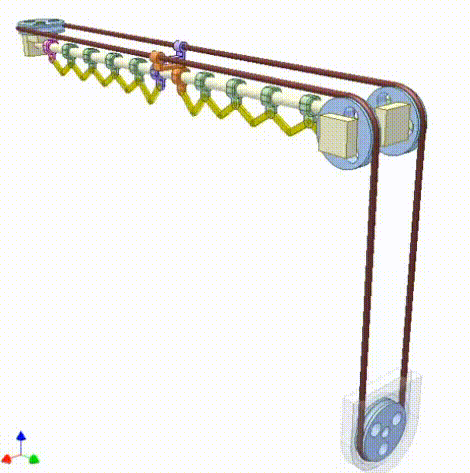

# The Smart Solar Trap

## Overview

Here in Britain, many people face the issue of freezing due to the inability to heat. This project has been made to help tackle this problem. 

Often, the temperature is affected by lack of insulation, particulary around the windows. Curtains are able to prevent this, but most people are away at work so unable to close the curtains after the sun stops heating the room. For this reason, we decided that the most prudent course of action for this project would be to automatically close the curtains at the optimal time. 

The system we designed closes the curtains when the sun goes away or the temperature in the room starts to drop, so as to keep the solar heat inside and reduce heating costs.

The system has a detector that can sense very bright light (i.e., the sun), a sensor to measure the temperature accurately and an actuator to release a curtain closing mechanism, which is triggered when the sun has vanished for a certain time or becomes too weak to effectivly heat the room. The system does not respond immediately, so that wrong measurements or reappearance of the sun do not result in reduced energy harvesting.

For cost reasons, the system does not support opening curtains automatically. Instead, the user needs to reset these manually.
Closing works by releasing a weight with a servo arm. The potential energy of the weight moves the curtain via simple pulleys.

Subsequent to closing action, the locking mechanism moves back into the original position for convenience in resetting the weight and curtain to harvest solar energy.

Work in progress includes pulling short range weather forecasts information from [open-meteo.org](https://open-meteo.com/) for making better decisions about curtain closing times.
We have considered using reinforment learning techniques to automate the system, but these are currently out of scope due to lack of training data and time.

## Members

| Person | Role | Job |
| :----: | :------: | ------ |
| hermonochy | Team leader | Lead the team and create a bridge between the hardware and software teams. |
| Meron3r | Programmer | Write the code to power the system. |
| OCBA1 | Mathematician | Calculations, physics and hardware |

## The Curtain System

We originally attempted a simple but effective curtain system, as shown in the video below:

However, the resistance between the curtain and the railing was so great that it overcame the pulley connected to the motor and the required parts to solve this were out the budget of this project, so we decided on a simpler mechanism, only to close the curtain. 
A weight would be connected to the curtain, to be released by a servo. The weight would fall and provide the energy to close the curtain. The user has to reset the curtain when the sun is about to heat the room again in the next morning. 

We attempted to do this on a real curtain, but soon realised that this would take too long to set up, should we have to bring it elsewhere. Therefore, we decided to do this on a [model curtain](#model-curtain), slightly smaller in size but far more mobile.

To reduce friction, we used fishing wire and a pulley. Due to this, we were able to roll the wire around the pulley several times, ensuring that it would not slip off. Our newtonmetre recorded that we needed roughly 0.4 N, the equivalent of an average size teddy bear. It worked perfectly first time, but for the pulley to hold, we required super glue as hot glue wasn't strong enough. Afterwards, the servo was attatched under it, to be connected to a loop at the bottom.

Next we glued on the servos with hot glue. Another challenge that we had to overcome was attaching the rest of the electronics (Raspberry Pi, Sensors and Arduino Nano), without them short circuiting against the curtain railing or getting in the way of the pulley system. 

## The Sensor System

In order to know when to close the curtain, we needed some sensors. Our options were:

- A temperature sensor
- A UV detector
- A Photoresistor (A light sensor)
- A Photo Diode (A faster-responding light sensor)

We eventually decided upon a Temperature and Light Sensor. The exact types were the [DS18B20](#temp-sensor) and [LDR Photo Resistor](#light-sensor) respectively. We bought 2 temperature sensors to place one directly next to the window and one in the middle of the room, to determine if the sun is still effectively heating.

Next, we continued to get the sensors functional. It was easy to use the temperature sensor by connecting it to a GPIO pin. However, the light sensor proved to be a bit more difficult since it provided an analog output. Therefore we needed to use an Arduino Nano to get the values, storing both in a CSV (**C**omma **S**eperated **V**alue) file for ease of reading. One big challenge we faced were annoying students walking in front of the sensors and people who might have been ventilating. This is shown in the file [plotWithPandas](TempLog/plotWithPandas.py). In it, we wasted the most time trying to decode the time stamp, which initially did not work as due to issues with matplotlib.

This program worked, but the data was shown all at once. Therefore, we created a seperate file [plotWithPandasAnimation](TempLog/plotWithPandasAnimation.py), to create an animation of the data as it went along. While animating the light and temperature values was relatively straightforward, handling the lines representing the closing times proved to be greater challenge. After several days of work, we managed to resolve it, but then encountered a problem with the labels. The labels only appeared at the end of the animation, and one label was made per line (this resulted in no less than 11 labels being plotted!). Since this did not affect the overall plot, we decided to leave it unresolved for now. 

Next we turned our attention to a demo program for the video, as the main program would have taken too long to demonstrate effectively. Initially, we focused solely on temperature as an input, which functioned adequately. However, we encountered isssues with the servo, which did not reset to the correct position and often twitched erratically. To solve this, we had to use the `pigpio` package instead. This didn't work at all, however, and we have yet to find out the problem. We attempted to program the majority on a seperate device due to low processing power on the rasberry pi, but this caused a minor problem with merge conflicts and authentication when using git.

## Our Orders

### Light sensor:

- Price: £ 3.99

- quantity: 1

- Link: https://www.ebay.co.uk/itm/201382079052?chn=ps&norover=1&itemid=201382079052&targetid=4585169654799843&device=c&mktype=&googleloc=&poi=&campaignid=412354547&mkgroupid=1305120599331881&rlsatarget=pla-4585169654799843&abcId=9300541&merchantid=87779

### Temp sensor:

- Price: £ 3.95

- quantity: 1

- Link: https://www.ebay.co.uk/itm/272667082078?chn=ps&var=571797800872&norover=1&itemid=571797800872_272667082078&targetid=4585169654799843&device=c&mktype=&googleloc=&poi=&campaignid=412354547&mkgroupid=1305120599331881&rlsatarget=pla-4585169654799843&abcId=9300541&merchantid=87779

### Servo

- Price: £3.99

- quantity: 1

### Arduino Nano

- Price: £4.99

- quantity: 1

### Micro SD Card

- Price: £ 7.99

- quantity: 1

### Salvaged Parts

- Price: Estimated at about £1

### Model Stand

- Price: £18.99

- quantity: 1

### Model Curtain

- Price: £10.19

- quantity: 1

### Total: £ 55.09

