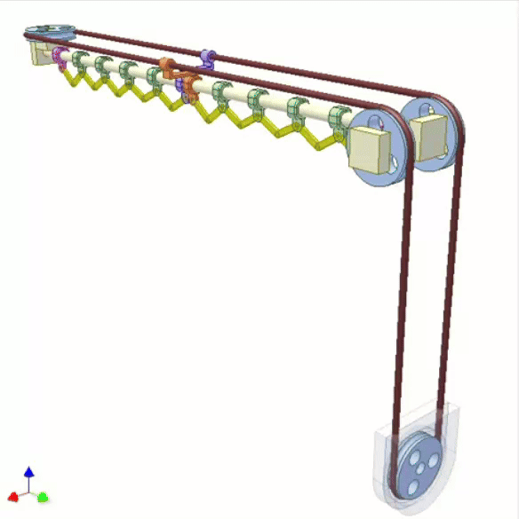

# Automatic curtain closer

This system closes the curtains when the sun goes away, to keep the solar heat in and reduce heating costs.

The system needs a detector that can sense very bright light (e.g., the sun), and can trigger curtain closing when the sun has vanished for a certain time. It should not close immediately, as it could be a wrong measurement, or the sun can come back.
If there is a internet connection, the system may take the short range weather forecast into account to make a decision to close.
For cost reasons, it is possible that the system may not be able to open the curtain again, and may need to be reset manually.
Closing works by releasing a weight with a servo arm. The potential energy of the weight moves the curtain via simple pulleys.
The locking mechanism should, for convenience, move back into the original position after releasing the weight for starting the curtain closing operation.

To start off, we split the jobs into small parts, assigned to each induvidual:

| Person | Job |
| ---- | ------|
| hermonochy | Create the hardware to open/close the curtains |
| Meron3r | Create a program to log the light sensor measurements |
| cheesecat123 | Create a program to log the temperature sensor measurements |
| OCBA1 | Find the required power of the motors |

## The Curtain System

We decided on a simple but effective curtain system, as shown in the video below:

Our main issue with this was that the resistance was so great that it overcame the pulley connected to the motor.

## Our Orders

### Light sensor:

- Price: £ 3.99

- quantity: 1

- Link: https://www.ebay.co.uk/itm/201382079052?chn=ps&norover=1&itemid=201382079052&targetid=4585169654799843&device=c&mktype=&googleloc=&poi=&campaignid=412354547&mkgroupid=1305120599331881&rlsatarget=pla-4585169654799843&abcId=9300541&merchantid=87779

### Temp sensor:

- Price: £ 3.95

- quantity: 2

- Link: https://www.ebay.co.uk/itm/272667082078?chn=ps&var=571797800872&norover=1&itemid=571797800872_272667082078&targetid=4585169654799843&device=c&mktype=&googleloc=&poi=&campaignid=412354547&mkgroupid=1305120599331881&rlsatarget=pla-4585169654799843&abcId=9300541&merchantid=87779

### Total: £ 11.89

